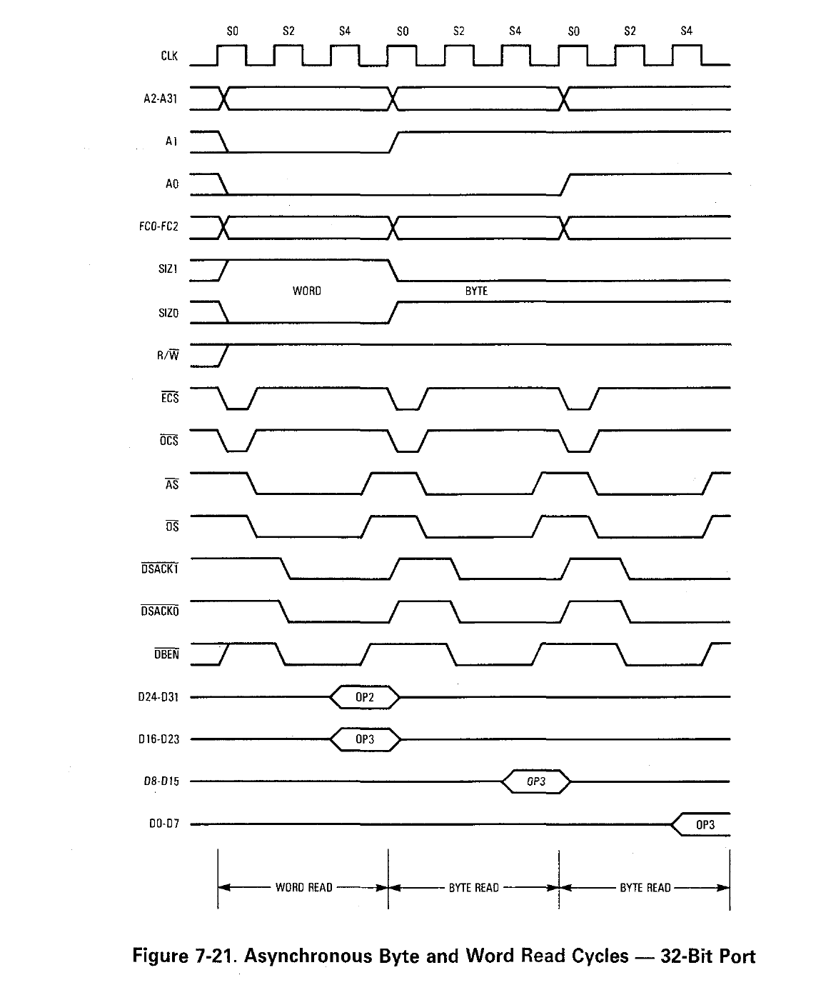
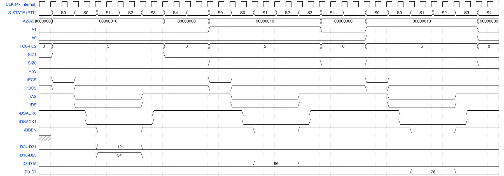

# MH030 — Cycle-Accurate Motorola MC68030 in SystemVerilog

A pin-level, cycle-accurate implementation of the Motorola MC68030 32-bit processor written in SystemVerilog. Every external bus signal (`/AS`, `/DS`, `R/W`, `FC[2:0]`, `SIZ[1:0]`, etc.) asserts and deasserts on the exact S-state cycle the real silicon does.

---

## Clock Strategy

The design runs at **4× the external bus frequency** — 100 MHz internal for a 25 MHz external bus. This gives four clean internal ticks per external clock half-cycle, which maps directly onto the 68030's S-state machine (S0–S5) without needing negedge triggers or clock-domain crossings. All logic is fully synchronous; there are no asynchronous resets or latches anywhere.

---

## Module Hierarchy

```
m68030_top
├── m68030_biu          Bus Interface Unit
│   ├── biu_arbiter         Priority arbiter: MMU > EU > IFU > external DMA
│   ├── biu_cycle_gen       S-state FSM — one branch per bus cycle type
│   ├── biu_sizing_fsm      Dynamic bus-width negotiation via DSACK0/1
│   ├── biu_pin_driver      Output pin control and tri-state management
│   ├── biu_byte_lane_ctrl  Write-data steering from SIZ[1:0] + A[1:0]
│   ├── biu_burst_ctrl      Burst linefill
│   ├── biu_multiop_fsm     MOVEM / MOVEP multi-transfer sequences
│   ├── biu_error_handler   BERR detection, timeout, fault capture
│   ├── biu_cache_if        D-cache: direct-mapped, per-word valid bits (Phase 133), write-through
│   ├── biu_icache_if       I-cache: direct-mapped, genuine SIZ=11 pin-level burst linefill — see `docs/cache.md`
│   ├── biu_mmu_if          MMU table-walk bus hijack port
│   ├── biu_exc_capture     Fault snapshot for exception stack frames
│   └── biu_config          Reset sequencing and tri-state release timing
├── m68030_ifu          Instruction Fetch Unit — 6-word prefetch queue (q[0]-q[5])
├── m68030_seq          Micro-sequencer — IFU→EU glue and extension-word counting
├── m68030_eu           Execution Unit
│   ├── eu_regfile          D0–D7, A0–A7, USP/MSP/ISP, PC, SR, VBR — 3 write ports, 3 read ports
│   ├── eu_alu              ADD/SUB/AND/OR/EOR/NEG/CMP/CLR/TST + X-extended forms
│   ├── eu_shifter          ASL/ASR/LSL/LSR/ROL/ROR/ROXL/ROXR, all sizes
│   ├── eu_mul_div          MULS/MULU (word+long), DIVS/DIVU (word+long)
│   ├── eu_bcd              ABCD/SBCD/NBCD
│   ├── eu_bitops           BTST/BCHG/BCLR/BSET
│   ├── eu_bitfield         BFTST/BFEXTU/BFEXTS/BFINS/BFCHG/BFCLR/BFSET/BFFFO
│   ├── eu_agu              Address Generation Unit — all EA modes including memory-indirect
│   └── eu_seq              Instruction decode, pipeline control, writeback
├── m68030_mmu          MMU — TLB, 3-level table walker, TT0/TT1, CRP/SRP
└── m68030_exc          Exception controller — all 8 68030 stack frame formats
```

The I-cache and D-cache each live inside `m68030_biu` as their own controller
(`biu_icache_if.sv` / `biu_cache_if.sv`) rather than as a separate top-level cache
module — see `docs/cache.md` for how they work and are tested.

---

## Bus Interface Unit

The BIU is the most critical module. It owns every external pin and is the sole place S-state transitions live. All other modules consume the `s_state` output — they never drive it.

### S-State Signal Timing

A real 68030 bus cycle is 6 states (S0–S5), 3 clocks, 0 wait states — confirmed
directly against MC68030UM.pdf §7.3.1/7.3.2, not the staggered 8-state model an
earlier design pass had assumed (see `CLAUDE.md`'s own "S-State Signal Timing"
section for the full correction history).

**Read** — /AS and /DS assert *together*:

| S-State | Action |
|---------|--------|
| S0 | Drive address, FC[2:0], SIZ[1:0], R/W; assert /ECS |
| S1 | Assert /AS and /DS together; negate /ECS |
| S2 | Assert /DBEN; device presents data + asserts DSACKx |
| S3 | DSACKx recognized (by end of S2) → cycle terminates; else insert wait states |
| S4 | Sample CIIN; data latched at end of S4 |
| S5 | Negate /AS, /DS, /DBEN — next cycle's S0 begins immediately, zero idle time |

**Write** — /AS and /DS do *not* assert together (/DS only once data is actually stable on the bus):

| S-State | Action |
|---------|--------|
| S0 | Drive address, FC[2:0], SIZ[1:0], R/W=write; assert /ECS, /OCS |
| S1 | Assert /AS and /DBEN; negate /ECS |
| S2 | Place write data on D0-D31; sample DSACKx at the end of S2 |
| S3 | Assert /DS |
| S4 | No new control signals |
| S5 | Negate /AS and /DS — next cycle's S0 begins immediately |

RMW/CAS/CAS2 genuinely negate /AS and /DS between their read and write phases,
then reassert for the write (a real, manual-confirmed difference from an
earlier design pass that held /AS continuously across the whole sequence).

### Dynamic Bus Sizing

The 68030 does not have a fixed external bus width. `biu_sizing_fsm` interprets the DSACK0/DSACK1 response from the peripheral:

| DSACK1 | DSACK0 | Bus Width |
|--------|--------|-----------|
| 1 | 1 | Wait (no termination yet) |
| 1 | 0 | 8-bit port |
| 0 | 1 | 16-bit port |
| 0 | 0 | 32-bit port |

For narrower ports, the BIU automatically issues repeated bus cycles to complete the full transfer, steering byte lanes via `biu_byte_lane_ctrl` using `SIZ[1:0]` + `A[1:0]`.

### Asynchronous Input Synchronization

`BERR`, `BR`, `IPL[2:0]`, `HALT`, `DSACK0`, `DSACK1`, and `STERM` are all external asynchronous inputs. Each passes through a 2-stage synchronizer flip-flop chain before any combinational logic touches them. This prevents metastability from propagating into the state machines. (`VPA`/`VMA`/E-clock — the 68000/68010's own legacy 6800-style synchronous-peripheral mechanism — don't exist on the 68030 at all and were removed from the RTL entirely.)

### Bus Cycle Types

`biu_cycle_gen` implements a distinct S-state sequence for each cycle type:

- **Normal read / Normal write** — S0–S5, standard sequence (see the S-State Signal Timing tables above)
- **Read-Modify-Write** — bus held locked between read and write phases; /AS does not deassert between them
- **Burst read** — /AS asserts only on the first longword; subsequent longwords toggle /DS only, with the address incrementing at a specific S-state
- **Interrupt Acknowledge** — FC=111, address encodes interrupt level in A[3:1] with A[31:4]=all-ones; peripheral responds with vector on D[7:0]
- **Coprocessor (FPU) cycles** — also FC=111 CPU Space, distinguished from IACK by A[19:16]=0010; A[15:13] encodes the primitive type (CPI/CPM/CPIR/CPCR)
- **CAS2** — four consecutive bus cycles without releasing the bus; the most complex single instruction in the ISA
- **MOVEP** — byte-interleaved cycles, address increments by 2 each transfer

### Function Codes

| FC[2:0] | Space |
|---------|-------|
| 001 | User Data |
| 010 | User Program |
| 101 | Supervisor Data |
| 110 | Supervisor Program |
| 111 | CPU Space (IACK or coprocessor) |

FC transitions at the same time as the address, never mid-cycle.

---

## Timing Diagrams

To sanity-check the S-state timing above against something outside this
project's own test harness, `timing_diagrams/` generates a bus-cycle
diagram straight from an Icarus Verilog simulation of `m68030_biu` and
places it next to the manual's own diagram for the same cycle:

<table>
<tr><th>MC68030UM.pdf, Figure 7-21 (leftmost cycle)</th><th>This RTL, simulated</th></tr>
<tr>
<td></td>
<td></td>
</tr>
</table>

Left: a crop of *Figure 7-21, "Asynchronous Byte and Word Read Cycles —
32-Bit Port"* (`docs/MC68030UM.pdf`, PDF page 194 / printed page 7-33) —
copyright NXP/Motorola, included here for direct visual comparison.
Right: the same three chained cycles the figure shows — a word read
followed by two byte reads, all within one test longword — driven
through `m68030_biu` and rendered from the resulting VCD, with the
address bus, byte-lane data split, `/ECS`/`/OCS`, and an S-state lane
all reproduced alongside `/AS`/`/DS`/`/DSACK`/`/DBEN`. `/AS` and `/DS`
assert together, matching this project's own S-state model above, not
the manual's own staggered legacy timing notation.

Building this diagram found and fixed a real, previously-undiscovered
bug: `/OCS` never asserted anywhere in the chip (`biu_cache_if.sv` had
its own "is this an operand transfer" output hardwired to 0, and
separately `biu_cycle_gen.sv`'s own `/OCS` assert/negate window was two
states later than MC68030UM.pdf specifies) — see `timing_diagrams/
README.md`'s own "A real bug this diagram found" section for the full
writeup. The two diagrams still differ in a couple of ways worth
knowing about before comparing them pixel-for-pixel: the `CLK` lane on
the right is this project's internal 4× clock, not the external bus
clock the manual's `CLK` shows; and a small idle gap still appears
between the RTL's three chained cycles that the manual's own
back-to-back timing doesn't have — not a testbench artifact. Digging
into it found three separate, stacked FSM layers between `eu_req` and
the bus pins each contributing their own one-tick "return to idle";
two are now fixed, the third (`biu_cache_if.sv`, the most delicate
module in the project by its own history) was attempted and reverted
after it broke MMU/cache correctness elsewhere — see `timing_diagrams/
README.md`'s own "Known differences" section for the full account.

See `timing_diagrams/README.md` for the full pipeline (testbench → VCD →
WaveDrom spec → PNG) and `timing_diagrams/diagrams.md` for the manifest
of what's been generated so far — currently just this one figure, with
the rest of the manual's own timing figures as a future extension.

---

## Execution Unit Pipeline

The EU uses a three-stage in-order pipeline. All stages are separated by flip-flop barriers; no two stages share an `always` block.

### Stage 1 — DECODE (combinational)

`eu_seq.sv` contains a large `always_comb` block (~2500 lines) that decodes the current `instr_word` into ~80 control signals: `dec_is_add`, `dec_reads_src`, `dec_src_reg`, `dec_siz`, `dec_writes_reg`, and so on. The structure is a priority `if/else if` tree keyed on the opcode group field `[15:12]`, then sub-fields within each group. These signals are pure combinational — no state, no memory.

### Stage 2 — EXECUTE (registered)

On each clock edge the `dec_*` signals are latched into `ex_*` equivalents. From here:
- The ALU, shifter, and multiplier receive their operands
- Memory requests are issued to the BIU (`mem_req`, `mem_addr`, `mem_wdata`, `mem_siz`)
- The `eu_agu` computes effective addresses for all EA modes

The EX stage stalls when waiting for `mem_ack` (load/store), when a multi-phase operation is in progress (CMPM, MOVEM), or when the extension word is not yet available from the IFU (`need_ext`).

Hazard detection prevents a register being read before a prior instruction has written it back. The stall condition is:

```
stall = ex_mem_stall || hazard_ex || hazard_wb || hazard_ccr || need_ext
```

### Stage 3 — WRITEBACK (registered)

Results latch into `wb_*` and the regfile write port fires. The EU has three independent write ports:
- **wr** — any Dn or An (main result)
- **an_wr** — An only (postincrement/predecrement address updates)
- **wr2** — Dn only (64-bit multiply/divide high word; EXG Dx,Dy second register)

### Instruction Fetch and Extension Words

`m68030_ifu` maintains a 6-word prefetch queue (`q[0]`-`q[5]`) — wide enough for the opcode plus up to 5 extension words, the worst case being genuine memory-indirect EA with a long base *and* long outer displacement together. `m68030_seq` sits between the IFU and EU: it counts how many extension words the current opcode needs (0 through 5, depending on addressing mode), converts the IFU's extension word format to the EU convention, and tells the IFU how many queue entries to drain when the EU accepts an instruction.

The EU stalls on `need_ext` if it requires an extension word and `ext_valid` is not yet asserted — this is the only IFU→EU back-pressure mechanism.

---

## Caches

Both the I-cache and D-cache are direct-mapped, live inside `m68030_biu` (as
`biu_icache_if.sv`/`biu_cache_if.sv`), and are disabled at reset (`CACR`, all-zero
until software enables them — every test in the project runs with caches disabled
unless it's specifically exercising cache behavior). The D-cache is
**write-through only**: every store goes to the external bus simultaneously, no
write-back cycles, matching real 68030 silicon. The I-cache fills via genuine
`SIZ=11` pin-level burst linefill.

**See `docs/cache.md`** for how each cache works, their timing, and how they're
tested (correctness, aliasing/eviction, CACR flush, self-modifying code, BERR
mid-linefill, and combined-with-pipeline-stalls coverage).

---

## Exception Stack Frames

The 68030 has eight distinct exception stack frame formats. `m68030_exc` generates all of them. `biu_exc_capture` snapshots the fault address, data, FC, R/W, and internal pipeline state at the exact moment of a bus fault so the larger frame formats ($A, $B) can be populated accurately.

| Format | Size | Trigger |
|--------|------|---------|
| $0 | 4 words | Most exceptions |
| $1 | 4 words | Throwaway frame pushed to ISP when an interrupt is taken with M=1 |
| $2 | 6 words | TRAPV, CHK, CHK2, Zero Divide, MMU Configuration |
| $4 | 8 words | FPU post-instruction (not implemented — unreachable) |
| $8 | 29 words | FPU pre-instruction (not implemented — unreachable) |
| $9 | 10 words | Coprocessor Mid-Instruction (not implemented — unreachable) |
| $A | 16 words | Bus error/address error at instruction boundary (incl. MMU faults) |
| $B | 46 words | Bus error/address error mid-instruction-execution (incl. MMU faults) |

There is no Format $3 — an earlier design pass documented one ("Address
Error, 8 words") that never existed on real silicon; address errors
correctly select $A/$B like any other bus error. Format $9 is also not
"MMU short bus fault" (another earlier misreading) — MMU-detected bus
faults use the ordinary $A/$B, distinguished by R/W like any other bus
error; real Format $9 is the unrelated Coprocessor Mid-Instruction frame.

---

## SIZ[1:0] Encoding

`SIZ[1:0]` are **outputs** from the CPU telling the peripheral the requested transfer size. Bus width is determined dynamically from the DSACK response.

| SIZ[1:0] | Transfer |
|----------|----------|
| 00 | Longword (32-bit) |
| 01 | Byte (8-bit) |
| 10 | Word (16-bit) |
| 11 | Line (16-byte burst) |

---

## Simulation and Verification

**Tools**: Icarus Verilog and Verilator (simulation), Python 3 (test harnesses), WaveDrom (rendering timing diagrams from simulation VCDs — see "Timing Diagrams" below). GTKWave was considered for waveform debug but isn't installed on the reference machine (Homebrew's own cask is deprecated/disabled upstream) and isn't part of this project's actual verification pipeline.

**Test strategy**: Three independent verification layers:

1. **Unit + integration regression** (`make test`) — 35 testbenches covering BIU S-state timing, EU instruction decode, exception frames, MMU, both caches, full-chip co-simulation, and pipeline stall/hazard behavior. 35/35 pass.

2. **Bus co-simulation** (`make cosim_grp`, `make cosim_memind`) — run opcode-group and memory-indirect-EA assembly programs through both the DUT and Musashi (reference 68030 emulator), diff bus logs cycle-by-cycle.

3. **Tom Harte SingleStepTests** — 68000 one-instruction test vectors (JSON, ~8000 per instruction mnemonic). Each test sets initial register + memory state, executes one instruction, and verifies final state. Structurally single-instruction — see `docs/stalls.md` for what this can't reach. All 124 suites are either 100% pass or a documented, confirmed non-bug (2 corpus data anomalies, plus permanent 68000-vs-68030 divergences that can't be replicated by construction) — see `plan.md` for the full phase-by-phase history.

4. **Pipeline stall/hazard tests** (`tb/stall_hazard_tb.sv`, `tb/stall_fsm_tb.sv`, part of `make test`) — bus-arbitration contention, RAW/CCR/autoincrement/CCR-write-collision hazards, control-transfer stall depth, multi-cycle FSM decode-holdoff, interrupt/BERR arrival mid-FSM, internal-exception dispatch races, and back-to-back FSM composition across real multi-instruction sequences. **See `docs/stalls.md` for the full catalog** — what triggers each stall, where it lives in the RTL, and which test proves it works.

```bash
make test                  # 35/35 regression suite
make cosim_grp             # 8 opcode group bus comparisons (DUT vs Musashi)
make dat-synth             # 50-vector synthetic dat-replay cosim; 50/50 pass
make sim/harte_dat         # rebuild Harte testbench binary after RTL changes
python3 -u scripts/run_harte.py tests/harte/ADD.b.json.gz    # single Harte suite
```

**Fast full-corpus sweep** (Phases 110-111): the original per-process runner above spawns
one `vvp` process per test (~0.2s each, ~99% fixed elaboration overhead), so a full
124-suite sweep takes ~6 hours. `scripts/run_harte_batch.py` batches many tests into far
fewer processes — same `can_run`/`gen_hex`/`compare` logic underneath, validated to
produce identical verdicts (zero differences across ADD.b, MOVEM.l, and the full corpus).
A Verilator backend compiles the DUT to native code instead of interpreting it, and wins
even bigger on expensive multi-cycle instructions than cheap ones (the opposite of the
Icarus-batching result) since it amortizes per-*cycle* cost, not just per-process spawn
cost:

```bash
make sim/harte_batch        # Icarus batched backend
make sim/harte_vbatch       # Verilator batched backend
python3 -u scripts/run_harte_batch.py tests/harte/*.json.gz tests/harte/*.json.bin \
    --backend verilator -j 10 --chunk-size 300   # full 124-suite corpus in ~3m18s
```

Full-corpus result: `PASS 702142 FAIL 2 SKIP 281221 TIMEOUT 0` — the 2 fails are the same
documented `ASL.b` corpus anomaly (below), zero other differences from the original
per-process runner. **This is the actual default for RTL-change verification gates** —
every RTL change with pipeline- or cache-wide reach runs this full sweep via the
Verilator batch backend (`--backend verilator -j 10 --chunk-size 300`) as part of the
project's mandatory verification gate, and it has stayed bit-identical since Phase 112.
`run_harte.py`'s single-suite, per-process form is still useful for a quick one-off
check of a single mnemonic during development. See `plan.md §Phase 110`/`§Phase 111`
for the full investigation (including two dead ends: tiered memory-array sizing and
SystemVerilog associative arrays, both rejected before landing on batching).

### Pipeline stall/hazard coverage

Every Harte test resets state, executes exactly one instruction, and checks the
result — by construction it can never exercise anything that spans two
instructions or an asynchronous event arriving mid-instruction. `tb/stall_hazard_tb.sv`
and `tb/stall_fsm_tb.sv` cover what that structurally leaves out: bus-arbitration
contention, RAW/CCR/autoincrement register hazards (with exact cycle counts),
control-transfer stall depth, decode-holdoff for all ~23 multi-cycle EX-stage FSM
sources (RMW locks, MOVEM/MOVEP, CAS/CAS2, genuine memory-indirect EA, and more),
DSACK wait-state composition, interrupt and bus-error arrival mid-FSM, two
CCR/exception-dispatch pipeline races found while verifying the caches (Phase 134),
and back-to-back FSM composition.

**`docs/stalls.md` is the authoritative catalog** — what triggers each stall, where
it lives in the RTL, and which test proves it works, kept current as new stall
sources or coverage are added. Don't duplicate it here; see that file directly.

Musashi-cosim also covers the 68020+-only genuine memory-indirect EA addressing
mode (`([bd,An],Xn,od)`), which Harte has zero coverage of since its corpus is
68000-captured — `make cosim_memind` runs the dedicated `tests/memind*.s` suite
against `tools/m68ksim`/`tools/buscmp.py`.

### Harte Pass Rates

**All 124 Harte suites are either 100% pass or a documented, confirmed non-bug** —
see `CLAUDE.md`'s "Current state" section for the live summary and `plan.md` for the
full phase-by-phase derivation of every fix along the way (many turned out to be
test-harness bugs in `gen_harte_hex.py`/`run_harte.py`, not RTL bugs; a handful were
genuine RTL bugs, root-caused and fixed; two categories are permanently, provably
unfixable — see below). The two non-bug categories:

- **ASL.b**: 2 of 8065 tests are confirmed Tom Harte corpus data anomalies (the
  claimed expected value doesn't match the initial value under any size/count/type
  for that opcode) — not a bug, cross-checked against 41 other passing instances of
  the same opcode.
- **TRAP/TRAPV-taken, and Address-Error's exception frame**: permanently unfixable
  by construction. The corpus is captured on real 68000 hardware, whose exception
  frame is narrower (3-7 words, no format field) than the 68030's correct frame
  (4-16 words, always includes a format/vector word). For traps the DUT's own
  *output* is this frame — there's no input to synthesize around the width
  mismatch, unlike other 68000-vs-68030 divergences this project *could* work
  around (e.g. RTE, where the corpus's input frame can be reshaped before feeding
  it in). Both cases are 100% SKIP by design, not failing.

### Known Architectural Gap — closed, but not the way originally expected

An early diagnostic (Phase 81, `AND.b` retested at 100% using the same 2-port
time-multiplexing trick a then-broken indexed-write form used) showed the
"needs a 3rd register-file read port" explanation for several indexed-EA failures
was overbroad. Following that thread through Phases 81-84, all four original
"looks like it needs a 3rd port" cases closed without ever touching the register
file — three were missing decode or test-harness bugs, and even the one case with
a plausible on-paper argument (CHK's indexed form) turned out solvable by the
existing 2-port deferred-swap trick, since the value it needs is only read *after*
the memory access completes, never simultaneously with the index register.

That result held until Phase 148-149 found the one genuine exception: **MOVE
Dn/An,(d8,An,Xn)** (register source, indexed destination) needs the base register,
index register, *and* source register all live in the same cycle for a plain write
— unlike every 2-port-solvable case, there's no bus-ack event before the write
starts to key a deferred swap off. Phase 148 added a genuine 3rd read port
(`eu_regfile.sv`'s `rd_c`); Phase 149 gave it its one real consumer, eliminating an
architecturally-unnecessary RMW "phantom read" this arm had been using as a
workaround since Phase 122. See `port3.md` for the full analysis and its own
corrected conclusion.

---

## Design Rules

- SystemVerilog throughout (`always_ff`, `always_comb`, `typedef enum`, `struct`)
- All logic synchronous — no latches, no asynchronous resets
- No combinational feedback loops
- `generate` loops for replicated structures (the 8 data registers, 8 address registers, etc.)
- Keep each module under ~3000 lines
- No timing optimizations that collapse or skip real silicon cycles
