# Timing diagram index

Every generated timing diagram, in the order the corresponding figure
appears in `docs/MC68030UM.pdf`. Each entry shows the manual's own figure
next to this RTL's simulated bus trace for the same cycle, rendered
through the real EU/decode pipeline (not a standalone bus-cycle drive)
unless noted. See `diagrams.md` for the full manifest (source testbench,
PDF/printed page, crop geometry) and `README.md` for the generation
pipeline.

## Figure 7-21 — Asynchronous Byte and Word Read Cycles, 32-Bit Port

Word read followed by two byte reads, all three chained with zero idle
gap.

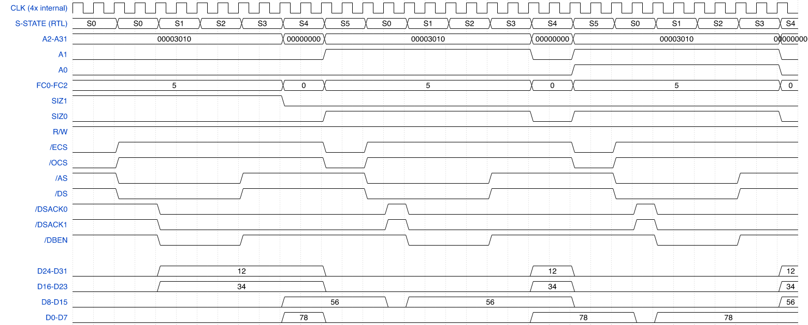

## Figure 7-22 — Long-Word Read, 8-Bit Port with CLOUT Asserted

`MOVE.L (A0),D0` against an 8-bit dynamic-sizing port: 4 chained byte
sub-cycles, SIZ sequence 00/11/10/01 (longword/3-byte/word/byte
remaining).

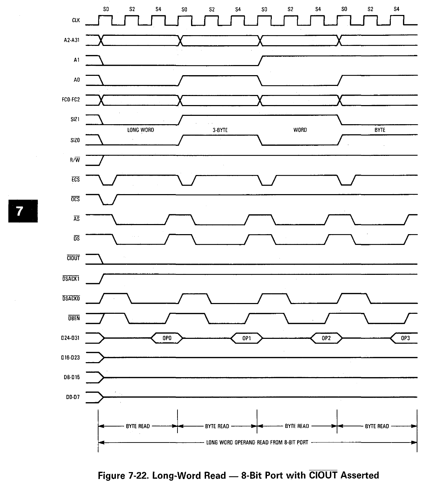
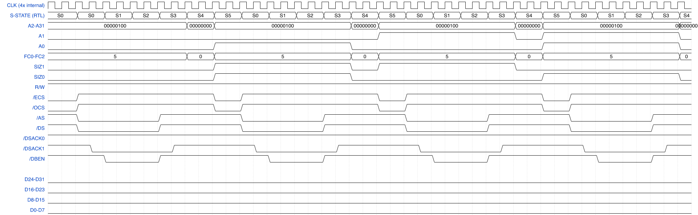

## Figure 7-23 — Long-Word Read, 16-Bit and 32-Bit Port

Same read against a 16-bit-port region: 2 chained word sub-cycles.

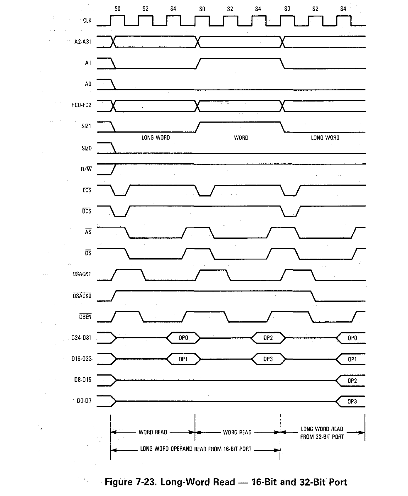
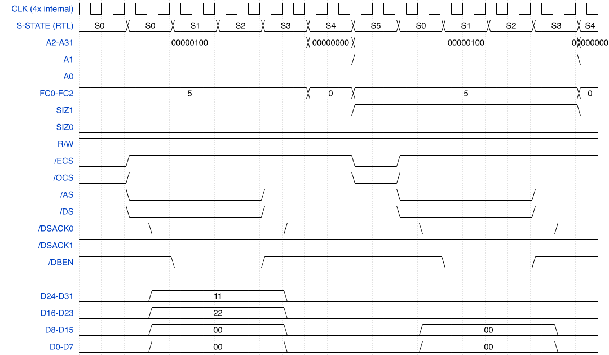

## Figure 7-25 — Read-Write-Write-Read Chain

Zero-wait-state portion: a read, two writes, and a trailing read, all
chained with zero idle gap — the diagram whose own construction found
and closed two real dispatch-gap bugs this session (the write-as-CURRENT
preview fix and the `biu_cache_if.sv` `CI_WRITE` fast-path fix, both in
`CLAUDE.md`'s post-Track-3 entries).

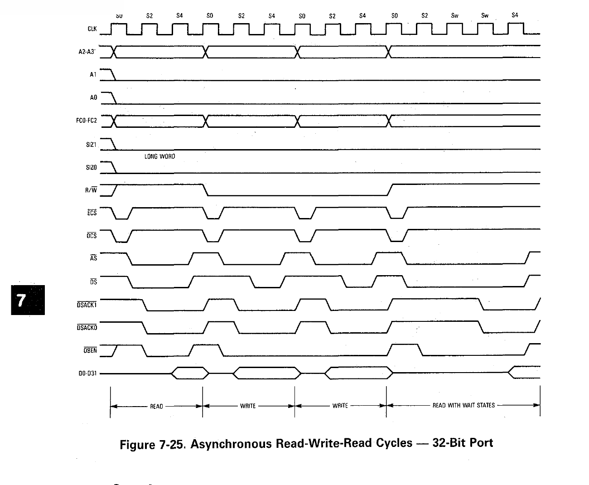
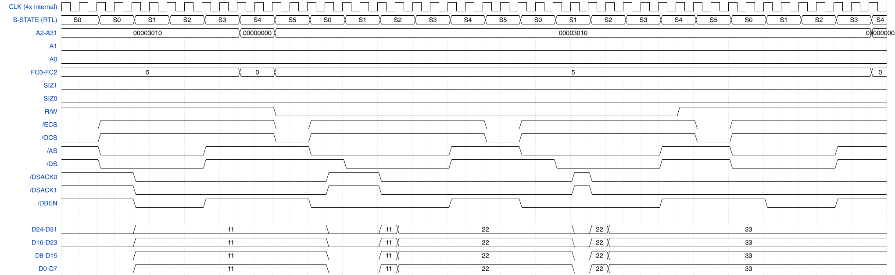

## Figure 7-26 — Asynchronous Byte and Word Write Cycles, 32-Bit Port

A word write followed by two byte writes, 32-bit port, zero idle gap.

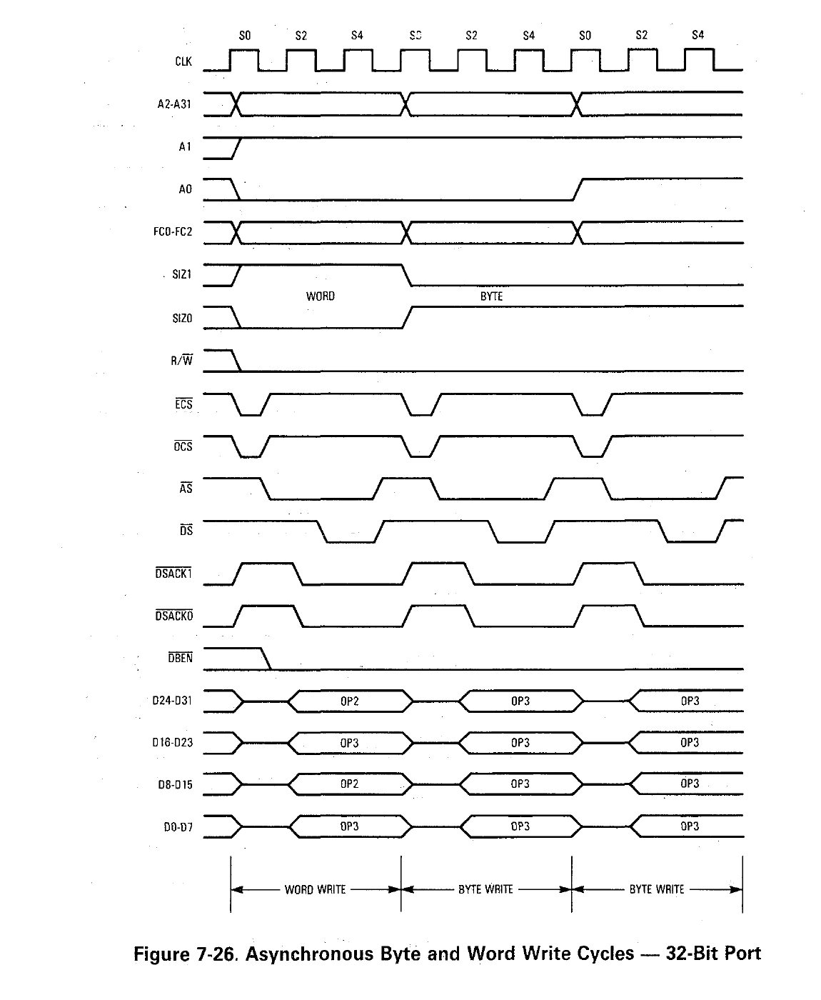
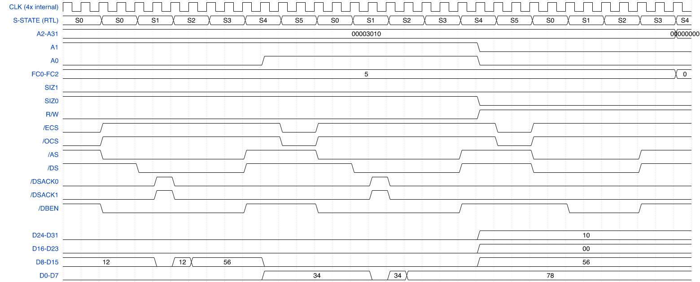

## Figure 7-28 — Long-Word Operand Write, 16-Bit Port

`MOVE.L D0,(A0)` against a 16-bit-port region: 2 chained word sub-cycle
writes.

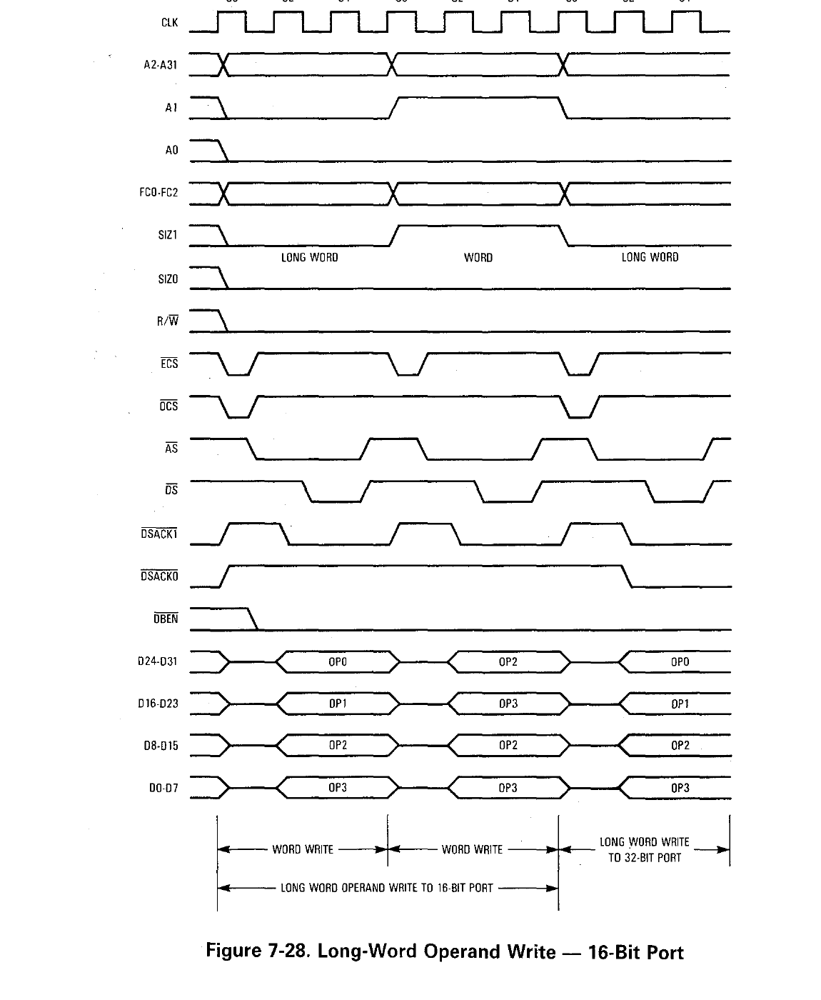
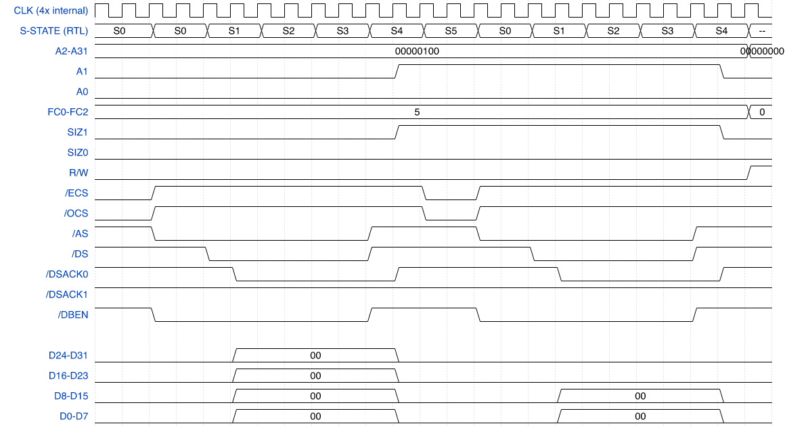

## Figure 7-30 — Asynchronous Byte Read-Modify-Write Cycle, 32-Bit Port

`TAS (A0)`'s own locked read-then-write. AS genuinely negates between the
read and write phases, then reasserts for the write (the F1 AS-continuity
fix, `CLAUDE.md`).

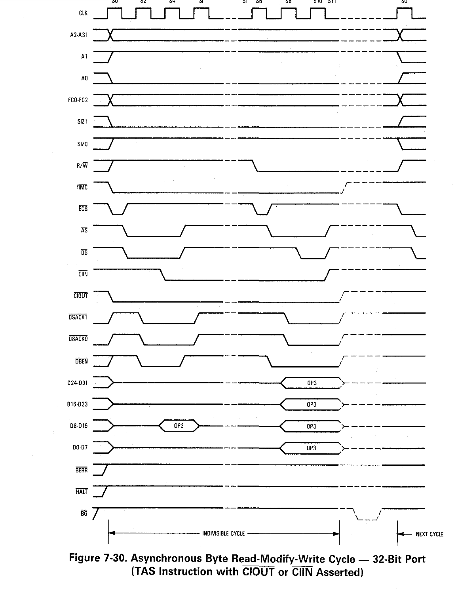
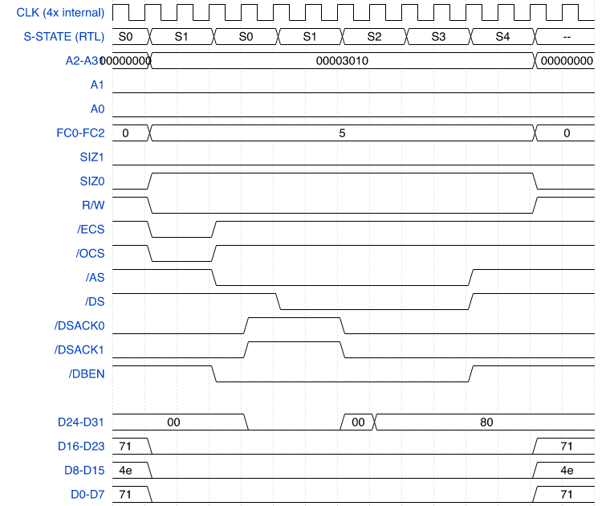

## Project-specific (no manual figure)

`preview_dispatch` demonstrates the EU-side dispatch-gap fix itself
(`CLAUDE.md`'s Phase 254 entry) directly — not a datasheet cycle, so
there's no manual page to compare against. See `diagrams.md` for detail.

## Scope

This set covers the core asynchronous read/write/RMW family reachable
via ordinary EU-driven instructions. Deliberately not attempted here:
synchronous STERM cycles, burst-mode timing diagrams, CPU space/IACK,
breakpoint acknowledge, bus error/retry, bus arbitration, and reset —
each is a substantially larger effort (its own testbench shape, in
several cases requiring external-device/multi-master stimulus this
project's existing testbenches don't build), left as a separate future
effort rather than folded into this one.
