# Timing diagram index

Every generated timing diagram, in the order the corresponding figure
appears in `docs/MC68030UM.pdf`. Each entry shows the manual's own figure
next to this RTL's simulated bus trace for the same cycle, rendered
through the real EU/decode pipeline (not a standalone bus-cycle drive)
unless noted. See `diagrams.md` for the full manifest (source testbench,
PDF/printed page, crop geometry) and `README.md` for the generation
pipeline.

## Figure 7-21 — Asynchronous Byte and Word Read Cycles, 32-Bit Port

Word read followed by two byte reads, all three chained with zero idle
gap.

## Figure 7-22 — Long-Word Read, 8-Bit Port with CLOUT Asserted

`MOVE.L (A0),D0` against an 8-bit dynamic-sizing port: 4 chained byte
sub-cycles, SIZ sequence 00/11/10/01 (longword/3-byte/word/byte
remaining).

## Figure 7-23 — Long-Word Read, 16-Bit and 32-Bit Port

Same read against a 16-bit-port region: 2 chained word sub-cycles.

## Figure 7-25 — Read-Write-Write-Read Chain

Zero-wait-state portion: a read, two writes, and a trailing read, all
chained with zero idle gap — the diagram whose own construction found
and closed two real dispatch-gap bugs this session (the write-as-CURRENT
preview fix and the `biu_cache_if.sv` `CI_WRITE` fast-path fix, both in
`CLAUDE.md`'s post-Track-3 entries).

## Figure 7-26 — Asynchronous Byte and Word Write Cycles, 32-Bit Port

A word write followed by two byte writes, 32-bit port, zero idle gap.

## Figure 7-28 — Long-Word Operand Write, 16-Bit Port

`MOVE.L D0,(A0)` against a 16-bit-port region: 2 chained word sub-cycle
writes.

## Figure 7-30 — Asynchronous Byte Read-Modify-Write Cycle, 32-Bit Port

`TAS (A0)`'s own locked read-then-write. AS genuinely negates between the
read and write phases, then reasserts for the write (the F1 AS-continuity
fix, `CLAUDE.md`).

## Figure 7-32 — Synchronous Read with CIIN Asserted and CBACK Negated

`MOVE.L (A0),D0` terminated via `/STERM` instead of `/DSACKx` —
`biu_cycle_gen.sv`'s own `sterm_active` bypass. `/CIIN` asserted, `/CBACK`
negated (no burst), matching the figure's own case exactly.

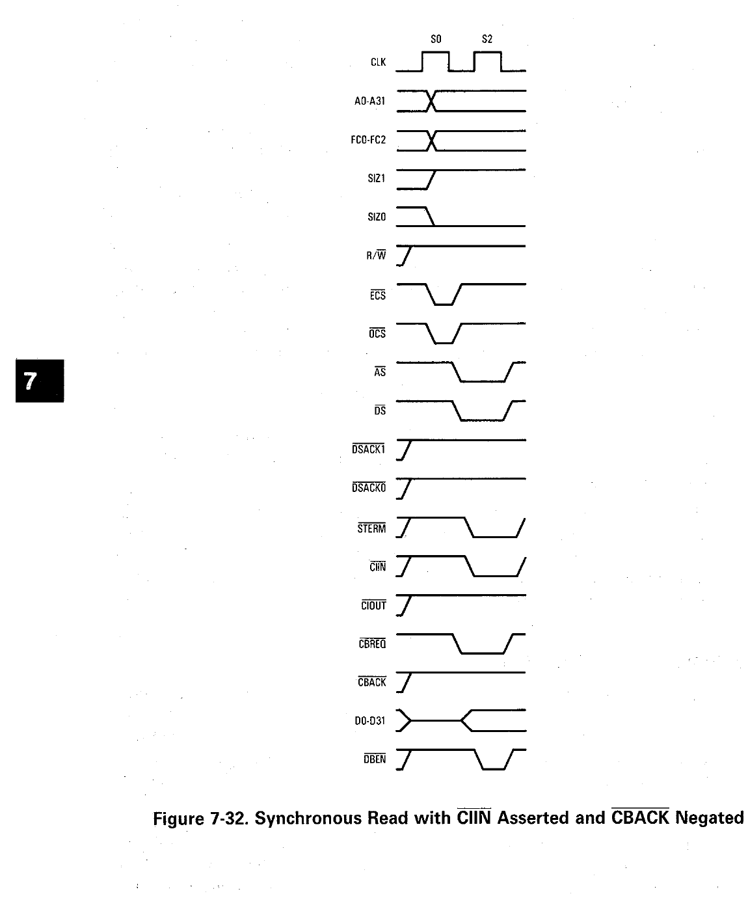
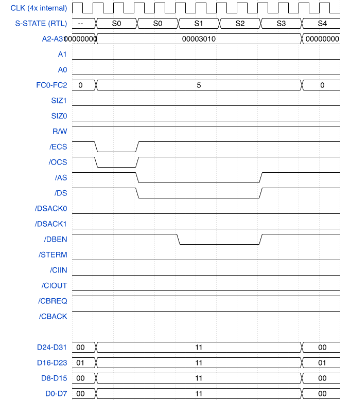

## Figure 7-38 — Long-Word Operand Request with Burst Request and Wait Cycle

A D-cache miss with `CACR.DBE` (burst enable) set triggers a real
4-longword burst line fill — all 4 beats shown, with `/CBREQ`/`/CBACK`
handshaking each one. `/DSACKx`-terminated rather than `/STERM` (the
shared `tb/mem_model.sv` this diagram uses is DSACK-only); real 68030
burst mode accepts either termination method.

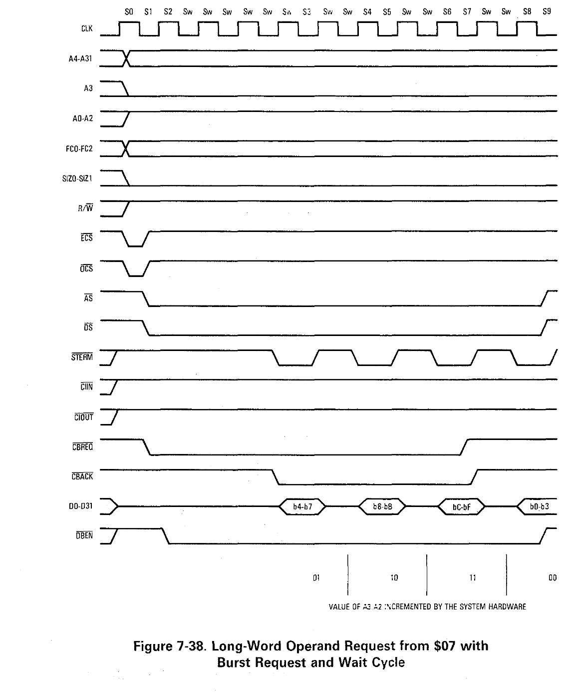
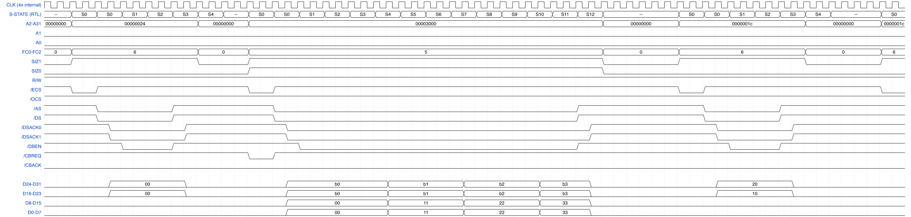

## Figure 7-44 / 7-45 — Interrupt Acknowledge Cycle Timing / Autovector Operation Timing

A genuine level-7 (NMI) interrupt request, recognized at the next
instruction boundary, dispatching a real CPU-space IACK bus cycle
(`FC=7`, address `$FFFFFFFx`), answered here with `/AVEC` (autovector),
followed by the exception frame push. Found and, in a later session,
fixed a real gap while building this
(`project_int_pending_level7_mask_gap.md`): `m68030_exc.sv`'s own
`int_pending` formula had no edge-triggered/non-maskable path for level
7, so a level-7 request asserted before anything lowered SR's own
reset-default mask of 7 was never recognized. Fixed via a sticky
edge-detect latch (`nmi_pending_r`) ORed into `int_pending`, set on any
transition of the synchronized IPL lines into level 7 and cleared once
the interrupt actually dispatches. The test program no longer lowers
the mask before looping — SR's mask stays at its reset-default 7
throughout, exercising the fix directly rather than working around it.

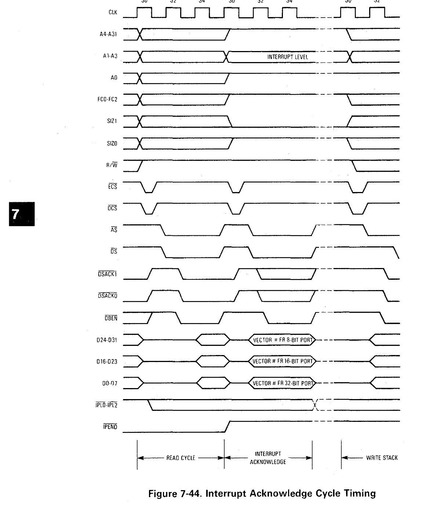
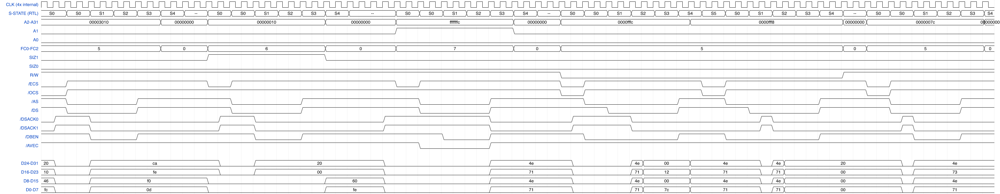

## Figure 7-47 — Breakpoint Acknowledge Cycle Timing

`BKPT #7` dispatches a CPU-space read (`FC=7`, address = breakpoint
number × 4) answered with a substitute opcode word via ordinary
`/DSACKx` response (mirrors `tb/stall_fsm_tb.sv`'s own established
BKPT-live-substitution convention) — execution continues with the
substituted instruction.

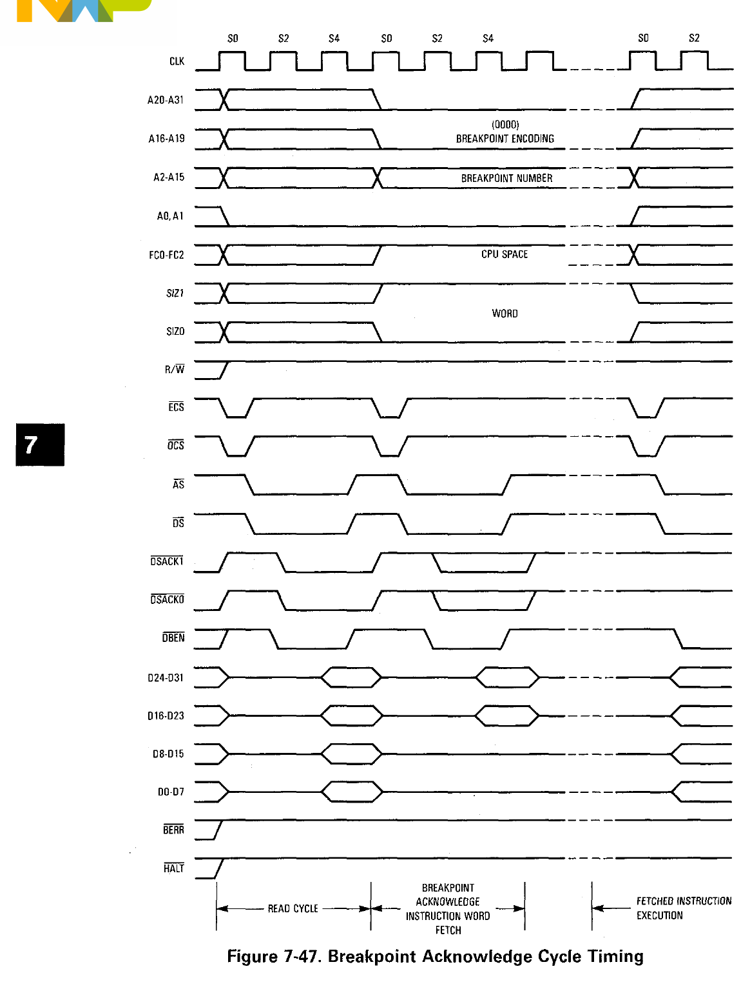
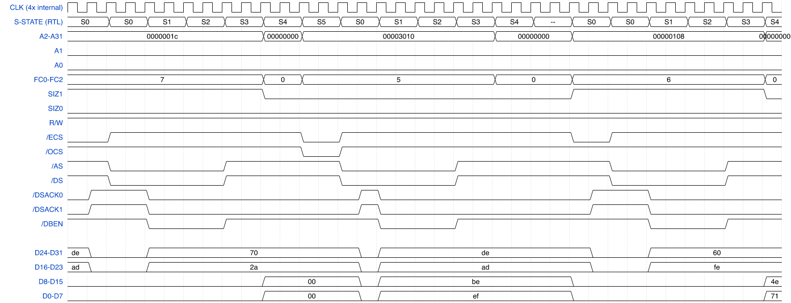

## Figure 7-49 — Bus Error without DSACKx

An ordinary read to a non-responding address, terminated by `/BERR`
alone (`/DSACKx`/`/STERM` never assert). Found and, in a later session,
fixed a real gap while building this
(`project_berr_no_halt_retry_loop.md`): with `/HALT` left deasserted
(the "plain BERR → exception" path), this specific construction
re-dispatched the same faulting access repeatedly instead of ever
completing exception dispatch. Root cause: `biu_sizing_fsm.sv` (sitting
between `biu_cache_if.sv` and `biu_cycle_gen.sv`) had no BERR-abort path
at all — its state machine only ever exited its active sub-cycle state
on a successful ack, which a genuinely faulted cycle never produces, so
it got stuck forever re-driving the stale faulting address into
`biu_cycle_gen` regardless of what the exception controller wanted to
dispatch next. Fixed via a new `cyc_berr` input (mirroring
`biu_cache_if.sv`'s own `sf_berr`) that resets it cleanly back to idle —
the exception now genuinely completes end-to-end. The diagram itself
still only needs the one faulting bus cycle's own pin-level timing,
unaffected either way and shown here.

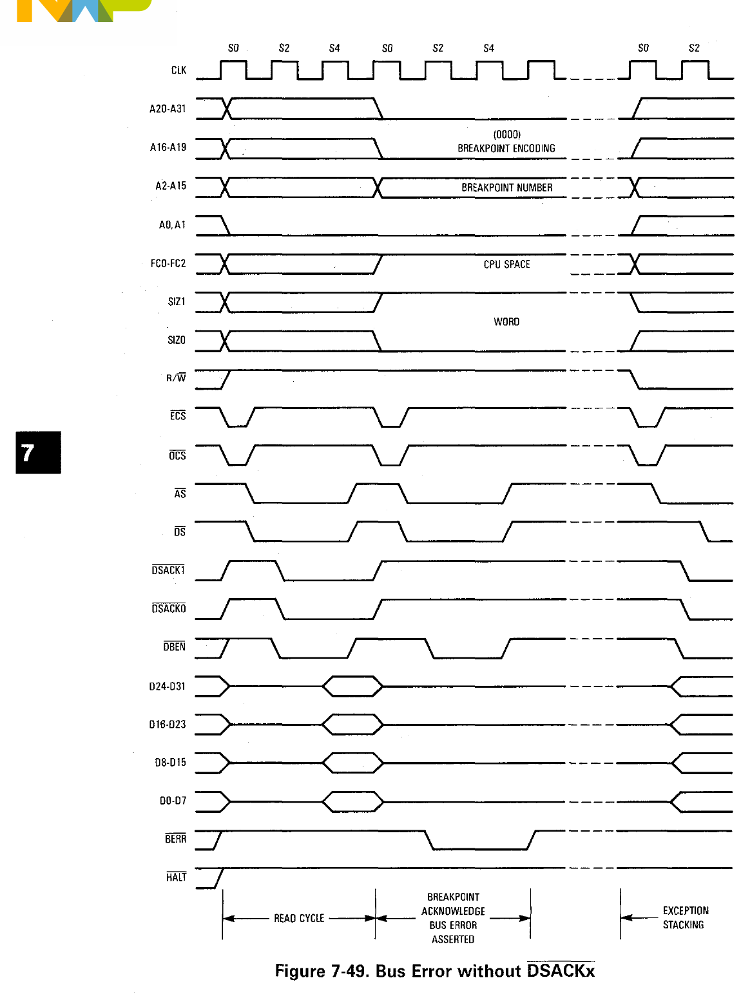
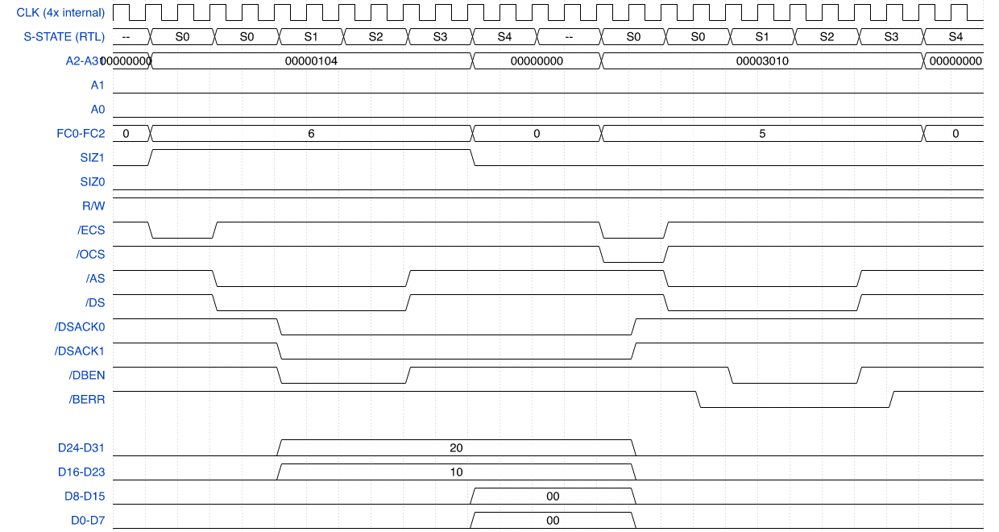

## Figure 7-60 — Bus Arbitration Operation Timing

An external DMA device requests the bus (`/BR`), the CPU grants it
(`/BG`) once its own current cycle completes, the device acknowledges
(`/BGACK`) and holds the bus, then releases it back.

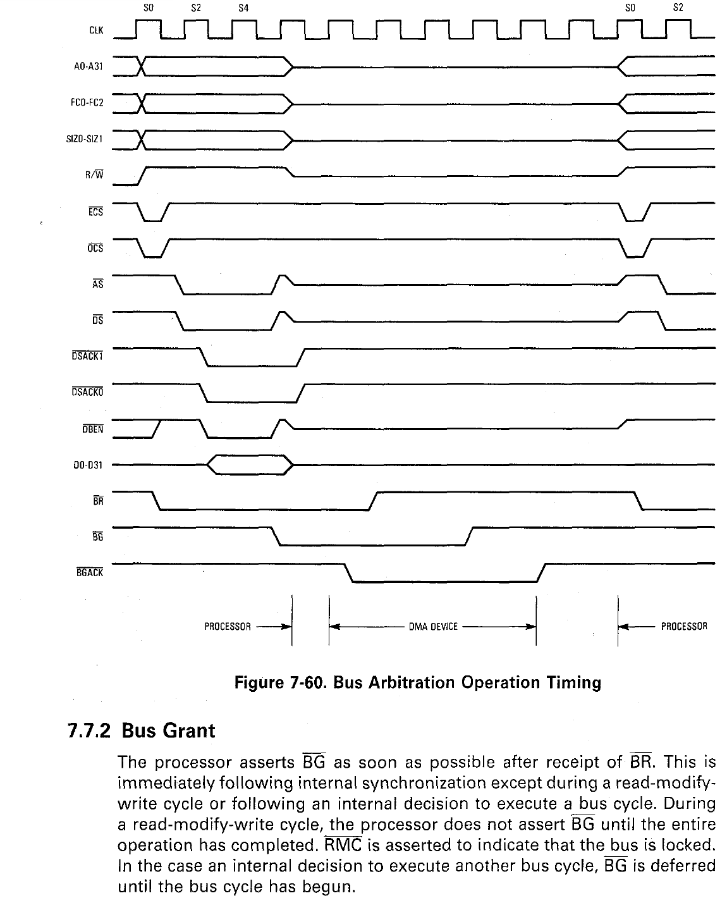
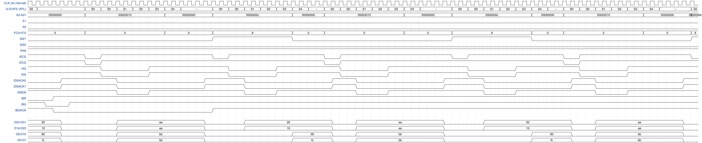

## Figure 7-64 — Initial Reset Operation Timing

The digital/bus-visible part of reset: `/RESET` held, the bus tri-stated,
then released and the real ISP (initial SSP/PC) read beginning. The VCC
ramp and analog timing spec the manual also shows aren't RTL-observable
(no analog power model in this project).

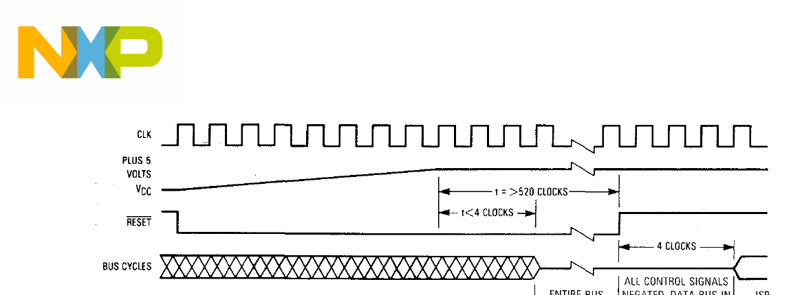
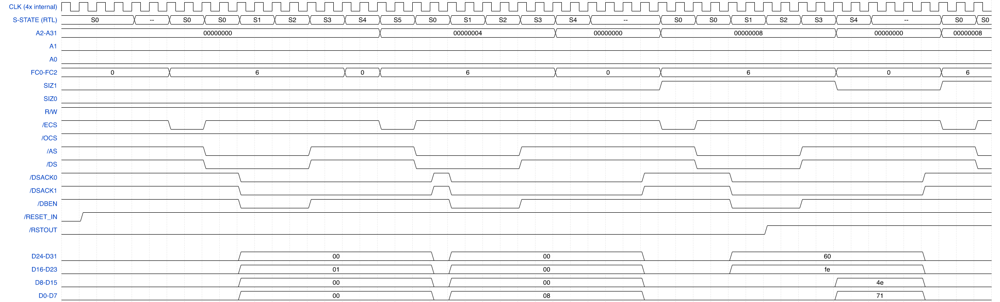

## Project-specific (no manual figure)

`preview_dispatch` demonstrates the EU-side dispatch-gap fix itself
(`CLAUDE.md`'s Phase 254 entry) directly — not a datasheet cycle, so
there's no manual page to compare against. See `diagrams.md` for detail.

## Scope

This set covers the core asynchronous read/write/RMW family reachable
via ordinary EU-driven instructions, plus synchronous STERM cycles,
burst-mode fills, CPU space/IACK, breakpoint acknowledge, bus error, bus
arbitration, and reset — one representative diagram per category rather
than exhaustive coverage of every figure within it. Not attempted:
synchronous RMW timing (Figure 7-36), the various late-BERR/retry
variants beyond Figure 7-49 (Figures 7-50 through 7-56), late retry for
a burst specifically (Figure 7-56), the remaining burst-fill variants
(Figures 7-39 through 7-41), and the misaligned-transfer example
diagrams (Figures 7-5 through 7-18, which mostly restate the dynamic-
sizing behavior Figures 7-22/7-23/7-28 already demonstrate) — each is a
straightforward extension of a category already covered here, left as
further optional additions rather than exhaustively built out.
